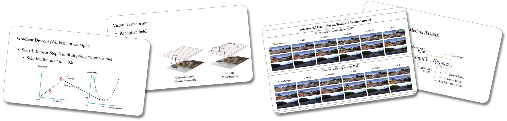

I have been a guest lecturer in graduate and undergraduate courses such as Machine Learning, Artificial Intelligence, and Intro to Neurocomputing.

-------------------

#### An Introduction to Transformers

- [Slides (2023)](https://poudel-bibek.github.io/pdfs/slides/intro_to_transformers)

-------------------

#### Optimization and Stochastic Gradient Descent

- [Slides (2023)](https://poudel-bibek.github.io/pdfs/slides/optimization_sgd) | [Slides (2022)](https://poudel-bibek.github.io/pdfs/slides/optimization_sgd)

-------------------

#### Introduction to Adversarial Machine Learning

- [Slides (2021)](https://poudel-bibek.github.io/pdfs/slides/intro_to_aml)
