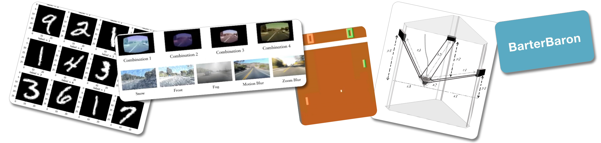

I have carried out projects in a wide range of topics.

-------------------

- "Artificial Intelligence Assignments", Developed and delivered programming assignments for graduate level AI and ML courses at University of Memphis. Topics include Deep Q Networks, Proximal Policy Optimization and Finetuning of a Transformer.
    - [Supporting Repo](https://github.com/poudel-bibek/AI-Assignments), [Sample website](https://poudel-bibek.github.io/AI-Assignments/) (content not available)

- "Robustness to Input Corruptions and Adversarial Examples in Steering Angle Prediction via Self-Supervision", Examined the use of self-supervised learning in steering angle prediction task to enhance model robustness under conditions such as snow, fog, frost, pixelation, and blur.
    - [Report](https://nbviewer.org/github/poudel-bibek/poudel-bibek.github.io/blob/main/data/reports/self_supervised.pdf), [Video](https://youtu.be/WIzKSNEtSuo), [Code](https://github.com/poudel-bibek/Contrastive)

- "Latent Representation of Inputs: A Defense Against Adversarial Examples in DQN", Used feature squeezing to improve the performance of a Deep Reinforcement Learning algorithm, DQN trained to play Atari Pong, under adversarial attacks.
    - [Report](https://nbviewer.org/github/poudel-bibek/poudel-bibek.github.io/blob/main/data/reports/latent_represent.pdf) 
    <!-- [Code](/sorry/) -->

- "Distributed Hyper-paramter tuning of Neural Networks", Parallelized the hyperparameter search objectives in grid search and random search using Distributed Hash Table so that computational resources are shared across multiple nodes to accelerate the search.
    - [Report](/sorry/)

- "BarterBaron: A commerce app based on barter system trade", Developed a ebay-like commerce platform using Ruby on Rails framework with features like chat, content search, and user authentication (won "Best project in the class" award).
    - [Demo video](https://youtu.be/ME8syiaELWw), [Code](https://github.com/memphis-cs-projects/comp7012-BarterBaron)

- "Delta Design 3D Printer", Designed and developed a working prototype of a 3D printer using Arduino Mega (Senior year Engineering project).
    - [Report](https://nbviewer.org/github/poudel-bibek/poudel-bibek.github.io/blob/main/data/reports/3D_Delta_printer.pdf)
