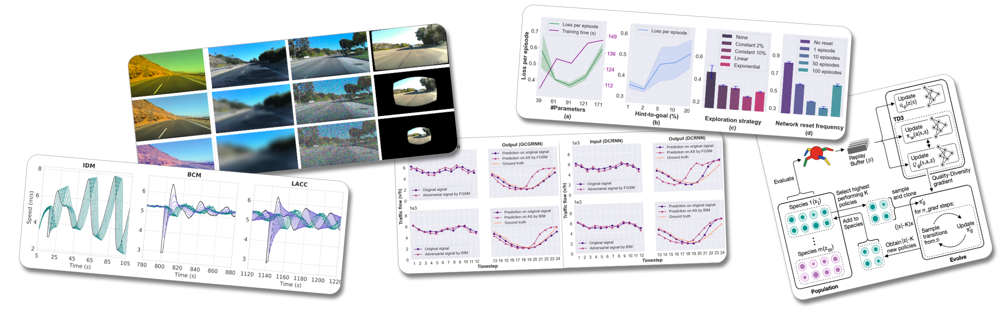

-------------------

#### EnduRL: Enhancing Safety, Stability, and Efficiency of Mixed Traffic Under Real-World Perturbations Via Reinforcement Learning
__Bibek Poudel__, Weizi Li, Kevin Heaslip  
IROS 2024  
[arXiv](https://arxiv.org/abs/2311.12261) | [Code](https://github.com/poudel-bibek/EnduRL) | [Video](https://youtu.be/TpyKSPNtrxM)

-------------------

#### AutoJoin: Efficient Adversarial Training for Robust Maneuvering via Denoising Autoencoder and Joint Learning
Michael Villarreal, __Bibek Poudel__, Ryan Wickman, Yu Shen, Weizi Li  
IROS 2024  
[arXiv](https://arxiv.org/abs/2205.10933) | [Code](https://github.com/tmvllrrl/AutoJoin) | [Video](https://youtu.be/Gb-byAgnskI)

-------------------

#### CARL: Congestion-Aware Reinforcement Learning for Imitation-based Perturbations in Mixed Traffic Control
__Bibek Poudel__, Shuai Li, Weizi Li  
IEEE CYBER 2024  
[arXiv](https://arxiv.org/abs/2404.00796) | [Code](https://github.com/poudel-bibek/CARL)

-------------------

#### Mixed Traffic Control and Coordination from Pixels
Michael Villarreal, __Bibek Poudel__, Jia Pan, Weizi Li  
ICRA 2024  
[Paper](https://ieeexplore.ieee.org/abstract/document/10610517) | [arXiv](https://arxiv.org/abs/2302.09167) | [Code](https://github.com/tmvllrrl/mtc-pixels) | [Video](https://youtu.be/g-aBGhdFHXU)

-------------------

#### Can ChatGPT Enable ITS? The Case of Mixed Traffic Control via Reinforcement Learning
Michael Villarreal, __Bibek Poudel__, Weizi Li  
ITSC 2023  
[Paper](https://ieeexplore.ieee.org/document/10422410) | [arXiv](https://arxiv.org/abs/2306.08094) | [Code](https://github.com/tmvllrrl/its-study)

-------------------

#### Efficient Quality-Diversity Optimization through Diverse Quality Species
Ryan Wickman, __Bibek Poudel__, Michael Villarreal, Xiaofei Zhang, and Weizi Li  
GECCO 2023  
[Paper](https://dl.acm.org/doi/10.1145/3583133.3590581) | [arXiv](https://arxiv.org/abs/2304.07425) | [Code](https://github.com/rwickman/NEAT_RL)

-------------------

#### Learning to Control DC Motor for Micromobility in Real Time with Reinforcement Learning
__Bibek Poudel__, Thomas Watson, and Weizi Li  
ITSC 2022  
[Paper](https://doi.org/10.1109/ITSC55140.2022.9921919) | [arXiv](https://arxiv.org/abs/2108.00138) | [Video](https://www.youtube.com/watch?v=TgZS54wQ3ss) | [Code](https://github.com/poudel-bibek/NFQ_Golf_Cart)

-------------------

#### Black-box Adversarial Attacks on Network-wide Multi-step Traffic State Prediction Models
__Bibek Poudel__ and Weizi Li  
ITSC 2021  
[Paper](https://doi.org/10.1109/ITSC48978.2021.9564671) | [arXiv](https://arxiv.org/abs/2110.08712) | [Video](https://www.youtube.com/watch?v=yxOBCIl1o-Y) | [Code](https://github.com/poudel-bibek/black_box_traffic)

-------------------

<!-- - ”EnduRL: Enhancing Safety, Stability, and Efficiency of Mixed Traffic Under Real-World Perturbations Via Reinforcement Learning.”,  *IROS 2024*: __Bibek Poudel__, Weizi Li, Kevin Heaslip
    - [Arxiv](https://arxiv.org/abs/2311.12261), [Code](https://github.com/poudel-bibek/EnduRL), [Video](https://youtu.be/TpyKSPNtrxM)

- "AutoJoin: Efficient Adversarial Training for Robust Maneuvering via Denoising Autoencoder and Joint Learning.", *IROS 2024*: Michael Villarreal, __Bibek Poudel__, Ryan Wickman, Yu Shen, Weizi Li
    - [Arxiv](https://arxiv.org/abs/2205.10933), [Code](https://github.com/tmvllrrl/AutoJoin), [Video](https://youtu.be/Gb-byAgnskI)

- ”CARL: Congestion-Aware Reinforcement Learning for Imitation-based Perturbations in Mixed Traffic Control.”,  *IEEE CYBER 2024*: __Bibek Poudel__, Shuai Li, Weizi Li
    - [Arxiv](https://arxiv.org/abs/2404.00796), [Code](https://github.com/poudel-bibek/CARL)

- "Mixed Traffic Control and Coordination from Pixels.", *ICRA 2024*: Michael Villarreal, __Bibek Poudel__, Jia Pan, Weizi Li
    - [Paper](https://ieeexplore.ieee.org/abstract/document/10610517), [Arxiv](https://arxiv.org/abs/2302.09167), [Code](https://github.com/tmvllrrl/mtc-pixels), [Video](https://youtu.be/g-aBGhdFHXU)

- "Can ChatGPT Enable ITS? The Case of Mixed Traffic Control via Reinforcement Learning.", *ITSC 2023*: Michael Villarreal, __Bibek Poudel__, Weizi Li
    - [Arxiv](https://arxiv.org/abs/2306.08094), [Code](https://github.com/tmvllrrl/its-study)

- "Efficient Quality-Diversity Optimization through Diverse Quality Species.", *GECCO 2023*: Ryan Wickman, __Bibek Poudel__, Michael Villarreal, Xiaofei Zhang, and Weizi Li
    - [Paper](https://dl.acm.org/doi/10.1145/3583133.3590581), [Arxiv](https://arxiv.org/abs/2304.07425), [Code](https://github.com/rwickman/NEAT_RL)

- "Learning to Control DC Motor for Micromobility in Real Time with Reinforcement Learning.", *ITSC 2022*: __Bibek Poudel__, Thomas Watson, and Weizi Li
    - [Paper](https://doi.org/10.1109/ITSC55140.2022.9921919), [Arxiv](https://arxiv.org/abs/2108.00138), [Video](https://www.youtube.com/watch?v=TgZS54wQ3ss), [Code](https://github.com/poudel-bibek/NFQ_Golf_Cart)

- "Black-box Adversarial Attacks on Network-wide Multi-step Traffic State Prediction Models.", *ITSC 2021*: __Bibek Poudel__ and Weizi Li
    - [Paper](https://doi.org/10.1109/ITSC48978.2021.9564671), [Arxiv](https://arxiv.org/abs/2110.08712), [Video](https://www.youtube.com/watch?v=yxOBCIl1o-Y), [Code](https://github.com/poudel-bibek/black_box_traffic) -->
